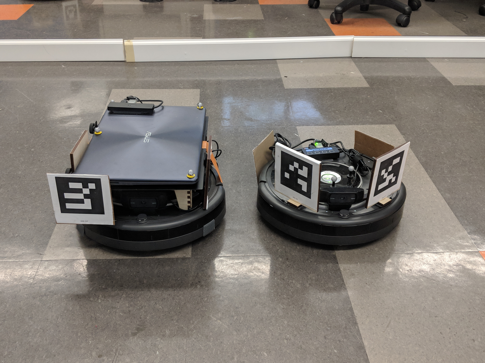

# LEMUR CoLo-PE

## Synopsis

CoLo-PE is the physical experiment of CoLo. It is a physical experiment setup for robots to collect 2-D datasets for multi-robot problems like cooperative localization (with only a team robots), cooperative localization with a known map, and cooperative simultaneous localization and mapping (SLAM). 

In CoLo-PE, there is a team of ground robots equipped with cameras and a groundtruth data collection system. Each robot can will log its odometry data and measurement data (based on AruCo) into its odometry file and measurement files

## [CoLo-PE Manual](https://docs.google.com/document/d/1tSIguoFJ5Fdcca0Eqcs4SZFRv2TBLSsm4NYaoaRcUwg/edit?usp=sharing)
The manual will explain the software and hardware used in CoLo-PE for users to help them create their own experiments in details: 

## Running CoLo-PE

1. Make sure the groundtruth data collection system can capture all the needed subjects includes landmarks and robots
2. Start groundtruth data collection
3. Remotely start robots 
4. Wait for data collection process 
5. Remotely deactivate robots 
6. Stop groundtruth data collection
7. Organized all the files into a single folder 
8. Data processing for collected data 

## Robot Control 

In CoLo-PE, we use desktop sharing for the remote control of the robots.

'''
$ cd catkin_ws
$ source devel/setup.bash
$ ./robot_full_run.sh
'''

## Authors
Shengkang Chen

Clara Chun

## Photos

### Experiment trial in CoLo-PE

### Type I (left) and Type II (right)
