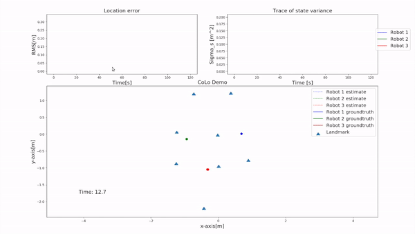

# LEMUR CoLo

## Note
This is a copy of the project I did at [UCLA LEMUR](https://uclalemur.com/).
[Project Website](https://uclalemur.com/research/colo-simulation-environment-for-cooperative-localization)
[Gitlab](https://git.uclalemur.com/billyskc/CoLo). 

## Synopsis

Cooperative localization is still a challenging task for cooperative robot control. CoLo is a performance evaluation system for two-dimensional cooperative localization algorithms. The system consists of a physical experiment (CoLo-PE) for data collection and a software analysis tool (CoLo-AT) using real-world datasets to evaluate the performances of users’ cooperative localization algorithms. The goal of this project to let users to create and evaluate their own algorithms with some existing algorithms.

## Structure

There are two main parts in CoLo: a physical experiment (CoLo-PE) for data collection and a software analysis tool (CoLo-AT)
In CoLo-PE, it will shows the requriment hardwares and softwares needed for setting up the the physical experiments. 
In CoLo-AT, users can load their localization algorithms and test their performances using different datasets on various settings. 
Each parts can be used independetly for users' needs. 

## Cite this work
```
@INPROCEEDINGS{Chen2019,
  author={Chen, Shengkang and Mehta, Ankur},
  booktitle={2019 International Conference on Robotics and Automation (ICRA)}, 
  title={CoLo: A Performance Evaluation System for Multi-robot Cooperative Localization Algorithms}, 
  year={2019},
  volume={},
  number={},
  pages={1458-1464},
  doi={10.1109/ICRA.2019.8794311}}
```

## Authors

**Shengkang Chen**

**Ben Limpanukorn**

**Ankur Mehta** 

## CoLo Structure


## CoLo-PE: Physical Experiment


## CoLo-AT: Analysis Tool 

